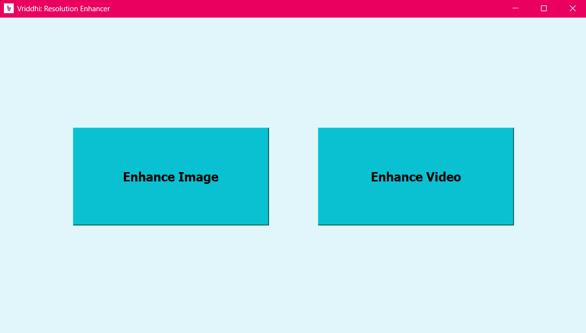
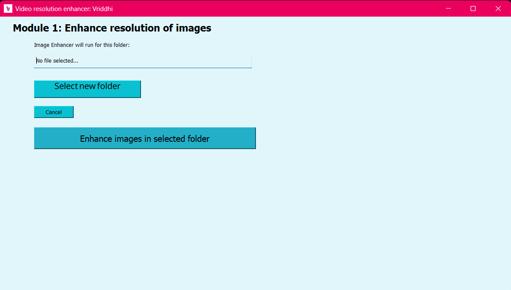
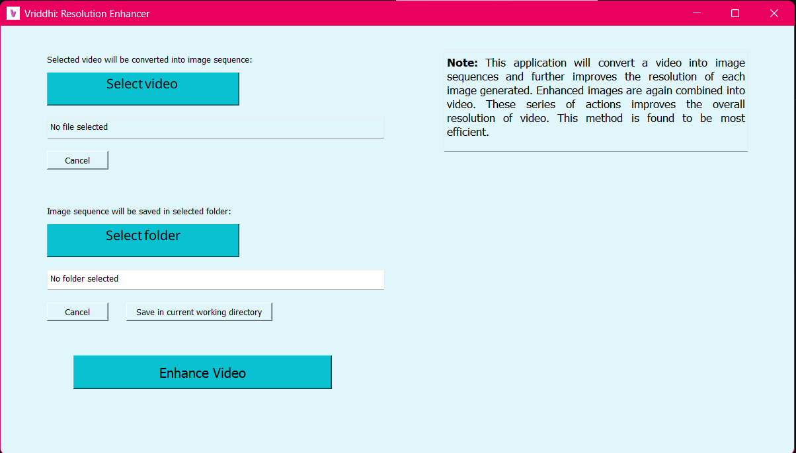

# Vriddhi

Vriddhi is a desktop application that uses deep learning algorithms to perform super resolution on images and videos. By upscaling low-resolution content to high-resolution, it provides users with a better viewing experience, especially in low-bandwidth and remote areas where expensive digital infrastructure is not available.

## Super Resolution using ESRGAN

Vriddhi uses a pre-trained Enhanced Super Resolution Generative Adversarial Network (ESRGAN) model to upscale images and videos by 4x. ESRGAN is a state-of-the-art deep learning method that enhances the visual quality of images beyond the original resolution.

## Installation

To install and run Vriddhi, follow these steps:

1. Clone the repository:

```
git clone https://github.com/ujjwaltyagi2000/vriddhi.git
```

2. Install dependencies:

   - If using pip:

     ```
     pip install -r requirements.txt
     ```

   - If using Anaconda:

     ```
     conda env create -f environment.yml
     conda activate vriddhi
     ```

3. Run the application:

```
python main.py
```

## Usage

To use Vriddhi, follow these steps:

1. Open the application.

   

2. Click on the "Enhance Image" or "Enhance Video" button to select the file you want to upscale.

   

   

3. Select the path where you wish to save the enhanced result.
4. Once the process is complete, you will be able to see the 4x upscaled result in your selected folder.

## Applications

Apart from providing high-quality videos in low-bandwidth and remote areas, Vriddhi has many other potential applications, such as:

- Enhancing the resolution of medical images for better diagnosis.
- Improving the quality of security camera footage for better identification of suspects.
- Enhancing satellite images for better analysis of environmental changes.
- Upscaling low-resolution images for printing or display purposes.

## Acknowledgments

- The ESRGAN model used in this project was trained by the authors of the [ESRGAN paper](https://arxiv.org/abs/1809.00219).
- This the [link](https://github.com/xinntao/ESRGAN) to the trained model.
